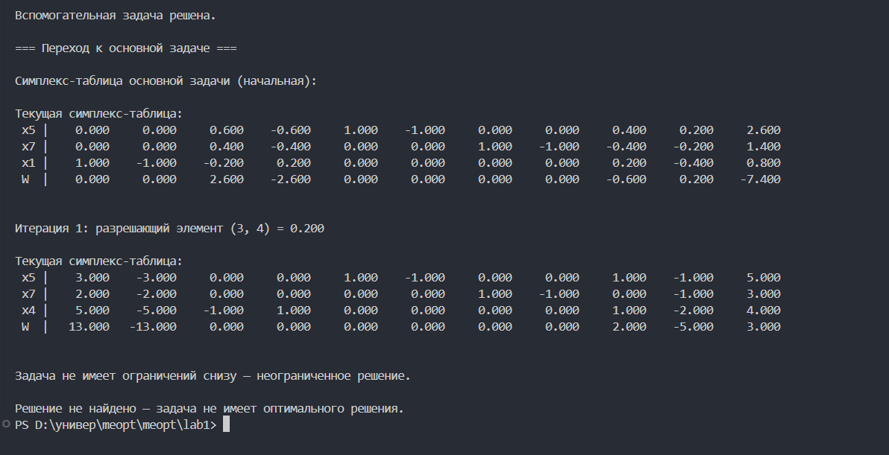

# Отчёт по заданию №1  
**Разработка программного обеспечения для решения задачи линейного программирования**

**Работу выполнил:**  
Москалец Данила Алексеевич  
**Группа:** 413016  
**Поток:** МЕТОПТ 1.1  
**Вариант:** 14  

---

## Краткое описание алгоритма решения ЗЛП

### Алгоритм 

1. **Приведение задачи к каноническому виду**  
   - Если целевая функция на *максимизацию* - умножаем её на –1 и решаем задачу как *минимизацию*.  
   - Если целевая функция на *минимизацию* - оставляем всё без изменений.  
   - Для ограничений:
     - знак ≥ -> вводим новую переменную со знаком минус;  
     - знак ≤ -> вводим новую переменную со знаком плюс;  
     - знак = -> оставляем без изменений.

2. **Учёт отрицательных переменных**  
   Если переменные могут быть отрицательными, заменяем каждую на разность двух неотрицательных: `xi = xi+ - xi-`
   где  
`xi+ = max(xi, 0)` и `xi- = max(-xi, 0)`.

3. **Построение вспомогательной задачи**  
В каждое уравнение вводим искусственную переменную для базиса.  
Составляем первую симплекс-таблицу, где базис - искусственные переменные.

4. **Формирование первой симплекс-таблицы**  
Последняя строка вычисляется как отрицательная сумма всех строк над ней.  
Далее:
- Находим наименьшее отрицательное значение в последней строке (кроме крайнего правого столбца) - это ведущий столбец.  
- Для него вычисляем отношения `bi / aij`, выбираем минимальное положительное - это ведущая строка.  
- Пересчитываем таблицу относительно разрешающего элемента.

5. **Построение новой таблицы**  
Разрешающую строку делим на разрешающий элемент (он становится 1),  
остальные элементы в этом столбце обнуляем элементарными преобразованиями строк.  
Повторяем, пока в последней строке все элементы не станут ≥ 0.

6. **Переход к основной задаче**  
Искусственные переменные удаляются.  
Подставляем найденные базисные переменные в исходную целевую функцию и пересчитываем коэффициенты.

7. **Решение основной задачи**  
Повторяем шаги симплекс-метода до тех пор, пока в последней строке не останется отрицательных элементов (кроме свободного члена).

8. **Запись ответа**  
- Базисные переменные = значения из последнего столбца.  
- Небазисные переменные = 0.  
- Значение целевой функции = нижний правый элемент таблицы.

---

## Инструкция по запуску программы

1. Убедитесь, что установлен Python 3.9+  
2. Клонируйте репозиторий или скачайте файлы проекта  
3. В корневой папке должны находиться:  
- `main.py` — основной файл программы  
- `task.txt` — файл с исходными данными задачи  
4. В файле `task.txt` задаются коэффициенты задачи в формате:
```
MIN                       
1 4 2 1                   
3                         
1 1 2 0 <= 6              
0 1 1 1 = 4
2 0 0 1 >= 3
```

5. Запустите программу командой:
```bash
python main.py
```

6. Программа выведет пошаговое решение с симплекс-таблицами в терминале.

## Демонстрация работы программы

### 1 Скрин задания (вариант 14)


### 2 Файл исходных данных `task.txt`


### 3 Скриншоты из терминала (пошаговое решение симплекс-методом)




### 4 Ручное решение на листе (проверка корректности)
  
  


### 5 Проверка результата в Excel (надстройка “Поиск решения”)


Результаты программы и Excel полностью совпадают, что подтверждает корректность реализации симплекс-метода.

## Рефлективный вывод

В процессе выполнения работы я глубже понял принципы симплекс-метода и особенности его программной реализации. Основной сложностью было учесть возможность отрицательных переменных, что изначально не было реализовано. После исправления и тестирования программа стала работать корректно, а сравнение с Excel подтвердило правильность решения. Этот опыт помог укрепить понимание численных методов оптимизации и навыки отладки сложных алгоритмов.


Ссылка на подкаст: https://drive.google.com/file/d/1I3V-iL8fAUfP6WfNoUCURnY5FGK4yKAC/view?usp=sharing