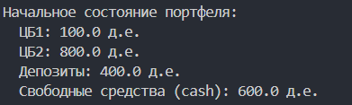

# Отчёт по заданию №4
**Решение задачи динамического программирования**

**Работу выполнил:**  
Москалец Данила Алексеевич  
**Группа:** 413016  
**Поток:** МЕТОПТ 1.1  

---

## Цель работы и постановка задачи
**Цель:** Разработать и реализовать метод динамического программирования для пошагового (многоэтапного) управления инвестиционным портфелем на горизонте 3 этапов с неопределёнными сценариями развития рынка. В результате получить алгоритм и программную реализацию, которые определяют оптимальную политику покупок/продаж ценных бумаг и депозитов, максимизирующую ожидаемый суммарный капитал инвестора в конце планируемого периода 

**Исходные данные:**
- Три типа активов: ЦБ1, ЦБ2, Депозит (Деп.). Есть также свободные деньги (кэш).
- Начальные объёмы в денежных единицах:
  - ЦБ1: \( 100 \, \text{д.е} \)
  - ЦБ2: \(  800 \, \text{д.е} \)
  - Деп.: \(  400 \, \text{д.е} \)
  - Свободные средства (ликвидный кэш): \( 600 \, \text{д.е} \)
- Горизонт планирования: T=3 этапа (этапы 1,2,3).
- На каждом этапе реализуется одна из трёх ситуаций: "благоприятная", "нейтральная", "негативная". Для каждого этапа известны вероятности и соответствующие коэффициенты изменения стоимости для каждого актива.

**Этап №1**
| Ситуация | Вероят. | ЦБ1 | ЦБ2 | Деп. |
|----------|---------|-----|-----|------|
| Благопр. | 0,60    | 1,20| 1,10| 1,07 |
| Нейтр.   | 0,30    | 1,05| 1,02| 1,03 |
| Негатив. | 0,10    | 0,80| 0,95| 1,00 |

**Этап №2**
| Ситуация | Вероят. | ЦБ1 | ЦБ2 | Деп. |
|----------|---------|-----|-----|------|
| Благопр. | 0,30    | 1,4 | 1,15| 1,01 |
| Нейтр.   | 0,20    | 1,05| 1,00| 1,00 |
| Негатив. | 0,50    | 0,60| 0,90| 1,00 |

**Этап №3**
| Ситуация | Вероят. | ЦБ1 | ЦБ2 | Деп. |
|----------|---------|-----|-----|------|
| Благопр. | 0,40    | 1,15| 1,12| 1,05 |
| Нейтр.   | 0,40    | 1,05| 1,01| 1,01 |
| Негатив. | 0,20    | 0,70| 0,94| 1,00 |

**Шаговое управление**

В модели предполагается, что изменение структуры инвестиционного портфеля происходит дискретно - за один шаг можно приобрести или реализовать некоторое количество активов. Для удобства объемы изменений выражаются в виде "пакетов", каждый из которых составляет четверть начальной стоимости соответствующего актива:

- для ЦБ1 один пакет равен 25 д.е. (100 / 4);
- для ЦБ2 - 200 д.е. (800 / 4);
- для депозитов - 100 д.е. (400 / 4).

То есть любое действие инвестора на каждом этапе сводится к покупке или продаже целого числа таких пакетов.

**Комиссии при операциях**

При осуществлении операций покупки/продажи учитываются комиссии:

- Покупка активов увеличивает расходы инвестора:
  - ЦБ1 - комиссия 4% от суммы сделки;
  - ЦБ2 - 7%;
  - депозиты - 5%.

- **При продаже** комиссия удерживается из получаемых средств, то есть реальная выручка всегда меньше номинальной стоимости реализованных активов.

Учет комиссий является обязательной частью модели, поскольку они напрямую влияют на доступный объем средств на каждом шаге управления.

**Ограничения** 

При выборе стратегии необходимо учитывать ряд ограничений:

- Инвестор распоряжается только имеющимися ликвидными средствами - привлечение кредитов не допускается.
- При продаже активов объем реализации ограничивается их фактическим количеством на данный момент времени.
- В портфеле должны сохраняться минимально допустимые уровни вложений:
  - ЦБ1 - не менее 30 д.е.;
  - ЦБ2 - не менее 150 д.е.;
  - Депозиты - минимум 100 д.е.

Эти пороги соответствуют требованиям задачи и не могут быть нарушены ни на одном этапе.

## Математическая формулировка задачи динамического программирования

### Обозначения

- **\( k \)** ∈ {0, 1, 2, 3} - номер этапа (\( k = 0 \) - начальное состояние, \( k = 1, 2, 3 \) - этапы планирования)
- **\( s_k \)** = \( (cb1_k, cb2_k, dep_k, cash_k) \) - состояние портфеля на этапе \( k \):
  - \( cb1_k \) - объем ЦБ1
  - \( cb2_k \) - объем ЦБ2
  - \( dep_k \) - объем депозитов
  - \( cash_k \) - свободные средства
- **\( u_k \)** = \( (\Delta cb1_k, \Delta cb2_k, \Delta dep_k) \) - управление на этапе \( k \) (изменения в единицах шагов)
- **\( w_k \)** ∈ {благоприятная, нейтральная, негативная} - случайная ситуация на этапе \( k \)
- **\( p_k(w_k) \)** - вероятность ситуации \( w_k \) на этапе \( k \)
- **\( f_k(s_k, u_k, w_k) \)** - функция перехода состояния
- **\( F_k(s_k) \)** - максимальный ожидаемый доход от этапа \( k \) до конца при начальном состоянии \( s_k \)

### Функция перехода состояния

Состояние изменяется в два этапа:

1. **Применение управления:**

   \[
   \begin{aligned}
   cb1_k' &= cb1_k + \Delta cb1_k \cdot 25 \\
   cb2_k' &= cb2_k + \Delta cb2_k \cdot 200 \\
   dep_k' &= dep_k + \Delta dep_k \cdot 100 \\
   cash_k' &= cash_k - (\Delta cb1_k \cdot 25 + \Delta cb2_k \cdot 200 + \Delta dep_k \cdot 100)
   \end{aligned}
   \]

2. **Применение случайной ситуации:**

   \[
   \begin{aligned}
   cb1_{k+1} &= cb1_k' \cdot k_{cb1}(w_k) \\
   cb2_{k+1} &= cb2_k' \cdot k_{cb2}(w_k) \\
   dep_{k+1}  &= dep_k' \cdot k_{dep}(w_k) \\
   cash_{k+1} &= cash_k'
   \end{aligned}
   \]

   где \( k_{cb1}(w_k), k_{cb2}(w_k), k_{dep}(w_k) \) — коэффициенты изменения стоимости для ситуации \( w_k \).

### Ограничения

1. **Ограничение на свободные средства (с учетом комиссий):**

   \[
   \text{cost}(\Delta cb1_k, \Delta cb2_k, \Delta dep_k) \leq cash_k
   \]

   где \( \text{cost}() \) учитывает комиссии:
   - При покупке: стоимость = номинальная_стоимость × \( (1 + \text{комиссия}) \)
   - При продаже: выручка = номинальная_стоимость × \( (1 - \text{комиссия}) \)

2. **Ограничение на продажу:**

   \[
   \begin{aligned}
   cb1_k + \Delta cb1_k \cdot 25 &\geq 0 \\
   cb2_k + \Delta cb2_k \cdot 200 &\geq 0 \\
   dep_k + \Delta dep_k \cdot 100 &\geq 0
   \end{aligned}
   \]

3. **Минимальные ограничения на активы:**

   \[
   \begin{aligned}
   cb1_k + \Delta cb1_k \cdot 25 &\geq 30 \\
   cb2_k + \Delta cb2_k \cdot 200 &\geq 150 \\
   dep_k + \Delta dep_k \cdot 100 &\geq 100
   \end{aligned}
   \]

4. **Неотрицательность:**

   \[
   cb1_k \geq 0, \quad cb2_k \geq 0, \quad dep_k \geq 0, \quad cash_k \geq 0
   \]

### Целевая функция

Максимизация ожидаемого суммарного дохода (критерий Байеса):

\[
\max \mathbb{E}[\,cb1_3 + cb2_3 + dep_3 + cash_3\,]
\]

где ожидание берется по всем возможным последовательностям ситуаций \( w_1, w_2, w_3 \).

## Обозначения, постановка задачи, рекуррентное соотношение для конкретной задачи;

Для нашей задачи с тремя этапами:

**Граничное условие (этап 3, после применения ситуации):**

\[
F_3(s_3) = cb1_3 + cb2_3 + dep_3 + cash_3
\]

**Этап 2:**

\[
F_2(s_2) = \max_{u_2 \in U_2(s_2)} \mathbb{E}_{w_2}\left[F_3(f_2(s_2, u_2, w_2))\right] = \max_{u_2} \sum_{w_2} p_2(w_2) \cdot F_3(f_2(s_2, u_2, w_2))
\]

**Этап 1:**

\[
F_1(s_1) = \max_{u_1 \in U_1(s_1)} \mathbb{E}_{w_1}\left[F_2(f_1(s_1, u_1, w_1))\right] = \max_{u_1} \sum_{w_1} p_1(w_1) \cdot F_2(f_1(s_1, u_1, w_1))
\]

**Этап 0 (начальное состояние):**

\[
F_0(s_0) = \max_{u_0 \in U_0(s_0)} \mathbb{E}_{w_0}\left[F_1(f_0(s_0, u_0, w_0))\right] = \max_{u_0} \sum_{w_0} p_0(w_0) \cdot F_1(f_0(s_0, u_0, w_0))
\]

**Оптимальное значение:**

\[
F_0(s_0) = \text{максимальный ожидаемый доход}
\]

## Основной алгоритм, который обеспечивает решение задачи динамического программирования

### Идея в двух словах

Мы работаем по этапам с конца в начало (этап 3 -> 0). Для каждого возможного состояния на этапе \( k \) вычисляем оптимальное управление \( u_k \) как то, которое максимизирует ожидаемую целевую величину на оставшемся горизонте. В каждом шаге учитываем вероятности сценариев и комиссии при купле/продаже.

### Формулировка дискретных действий

Пусть пакеты:

- **пакет\_CB1 = 25 д.е.,**  
- **пакет\_CB2 = 200 д.е.,**  
- **пакет\_Dep = 100 д.е.**

Управление на шаге - тройка целых чисел  
\[
\Delta = (\Delta_{cb1}, \Delta_{cb2}, \Delta_{dep}),
\]  
где положительное - покупка (кол-во пакетов), отрицательное - продажа.

Ограничения на допустимые \( \Delta \) генерируем так, чтобы:

- после операции размеры активов \( \geq \) минимальным порогам;
- нельзя продать больше, чем имеется;
- стоимость покупок (с учётом комиссий) \( \leq \) имеющегося cash (продажа даёт выручку с учётом комиссии, которая увеличивает cash до применения сценария);
- запрет на отрицательный cash после выполнения операций (т.е. промежуточный cash \( \geq \) 0).

### Функция расчёта стоимости/выручки сделки с комиссиями

Для каждого вида актива при произведённой операции количества пакетов \( n \) и номинальной сумме сделки \( S = n \cdot \text{[стоимость пакета]} \):

- **Покупка** (n>0): требуемые средства \( S \cdot (1 + c_{buy}) \).
- **Продажа** (n<0): поступление \( |S| \cdot (1 - c_{sell}) \).  

### Функция перехода состояния \( f_k(s_k, u_k, w_k) \)

1. **Применяем операцию \( u_k \):**  
   - \( cb1' = cb1 + \Delta_{cb1} \cdot \text{пакет\_CB1} \)  
   - \( cb2' = cb2 + \Delta_{cb2} \cdot \text{пакет\_CB2} \)  
   - \( dep' = dep + \Delta_{dep} \cdot \text{пакет\_Dep} \)  
   - \( cash' = cash - \text{cost\_of\_buys} + \text{proceeds\_from\_sales} \) (все с учётом комиссий)

2. **Применяем случайную ситуацию \( w_k \):**  
   умножаем каждый класс активов на соответствующий коэффициент \( k_{cb1}(w_k), k_{cb2}(w_k), k_{dep}(w_k) \).  
   \( cash \) не меняется при реализации сценария (депозит даёт коэффициент, который включён в \( k_{dep} \)).

### Рекуррентное соотношение (Беллмана) - конкретно

Обозначим \( F_k(s_k) \) - максимальный ожидаемый итоговый капитал (с учётом cash) при оптимальной стратегии от этапа \( k \) при начальном состоянии \( s_k \).

Граничное условие (после применения ситуации на этапе 3):

\[
F_3(s_3) = cb1_3 + cb2_3 + dep_3 + cash_3.
\]

Для \( k = 2, 1, 0 \):

\[
F_k(s_k) = \max_{u_k \in U_k(s_k)} \sum_{w_k} p_k(w_k) \, F_{k+1}(f_k(s_k, u_k, w_k)).
\]

Где \( U_k(s_k) \) - множество допустимых управлений, удовлетворяющих всем ограничениям.

## Описание алгоритма работы программы

Программа реализует метод динамического программирования для задачи многоэтапного управления инвестиционным портфелем на горизонте из трёх этапов в условиях неопределённости.

Алгоритм работает по принципу **обратной индукции (алгоритм Беллмана)** - вычисления выполняются от последнего этапа к начальному.

### Основные шаги алгоритма:

1. **Инициализация параметров:**  
   Задаются начальные параметры портфеля: объёмы активов ЦБ1, ЦБ2, депозитов и свободных денежных средств (`cash`), а также комиссии, вероятности сценариев и коэффициенты изменения стоимости активов.

2. **Перебор управлений:**  
   На каждом этапе перебираются все допустимые варианты управления портфелем — целочисленные операции покупки или продажи активов пакетами фиксированного размера.

3. **Проверка ограничений:**  
   Для каждого допустимого управления проверяются ограничения:
   - Недопустимость отрицательных объёмов активов;
   - Соблюдение минимальных порогов вложений;
   - Неотрицательный остаток `cash` с учётом комиссий.

4. **Применение управления:**  
   После применения управления рассчитываются новые значения портфеля.

5. **Рекурсивный вызов для сценариев:**  
   Для каждого возможного сценария развития рынка рассчитывается новое состояние портфеля и рекурсивно вызывается функция следующего этапа.

6. **Расчёт ожидаемого результата:**  
   Суммарный ожидаемый результат вычисляется как математическое ожидание по всем сценариям с учётом их вероятностей:
   \[
   E[\text{результат}] = \sum_{\text{сценарий}} p(\text{сценарий}) \times \text{значение\_портфеля}
   \]

7. **Выбор оптимального управления:**  
   Из всех допустимых управлений выбирается то, которое максимизирует ожидаемую итоговую стоимость портфеля.

8. **Результат работы:**  
   В качестве результата программа выдаёт максимальное ожидаемое значение суммарного капитала инвестора.

Таким образом, программа автоматически находит оптимальную стратегию управления портфелем, обеспечивающую максимальную ожидаемую доходность при заданных ограничениях.

## Описание основных функций программы

### Функция `calc_trade_cost(...)`

Предназначена для расчёта влияния операций покупки и продажи активов на величину свободных денежных средств с учётом комиссий.

**Функция:**
- Принимает количества пакетов для ЦБ1, ЦБ2 и депозитов;
- Рассчитывает номинальную сумму сделки по каждому активу;
- Добавляет комиссию при покупке и уменьшает поступления при продаже;
- Возвращает итоговую величину затрат (или поступлений), которая используется при расчёте нового значения `cash`.

---

### Функция `is_valid_action(...)`

Отвечает за проверку допустимости выбранного управления.

**Функция проверяет:**
- Соблюдение минимальных допустимых уровней вложений в активы;
- Отсутствие отрицательных значений активов после операции;
- Достаточность денежных средств с учётом комиссий;
- Невозможность продажи большего объёма активов, чем имеется в портфеле.

Возвращает логическое значение `True` или `False`, разрешая или запрещая выполнение операции.

---

### Функция `apply_action(...)`

Реализует непосредственное применение управления к текущему состоянию портфеля.

**Функция:**
- Изменяет объёмы активов в соответствии с выбранными пакетами покупки/продажи;
- Корректирует значение `cash` с учётом комиссии;
- Возвращает новое состояние портфеля после выполненных операций.

---

### Функция `apply_scenario(...)`

Моделирует влияние случайной рыночной ситуации на портфель.

**Функция:**
- Умножает стоимости активов (ЦБ1, ЦБ2, депозиты) на коэффициенты выбранного сценария;
- Не изменяет значение денежных средств;
- Возвращает состояние портфеля после реализации сценария.

---

### Функция `F(...)` — функция Беллмана

Это основная рекурсивная функция динамического программирования.

**Функция:**
- Реализует рекуррентное соотношение Беллмана;
- Для заданного этапа и состояния портфеля перебирает все допустимые управления;
- Вычисляет математическое ожидание результата по всем возможным сценариям;
- Выбирает управление, дающее максимальное ожидаемое значение итогового капитала;
- Возвращает максимальное значение целевой функции.

Используется механизм кэширования результатов (`@lru_cache`), что существенно ускоряет работу программы за счёт исключения повторных вычислений.

---

### Основной блок программы

В основной части:
- Задаётся начальное состояние портфеля;
- Вызывается функция `F(0, s0)` для старта расчёта;
- Выводится найденный максимальный ожидаемый итоговый капитал инвестора;
- Формируется подробное текстовое описание результата, пригодное для использования в отчёте.

## Результаты

## Заключение
В ходе выполнения лабораторной работы была реализована модель пошагового управления инвестиционным портфелем с использованием метода динамического программирования. Была сформулирована математическая постановка задачи, получено рекуррентное соотношение Беллмана и разработан алгоритм поиска оптимальной стратегии управления портфелем.

В процессе работы удалось на практике освоить принципы построения многoэтапных моделей принятия решений в условиях неопределённости, применение критерия математического ожидания (критерий Байеса) и программную реализацию рекурсивных алгоритмов.

В результате была получена программа, позволяющая находить оптимальные решения по покупке и продаже активов и оценивать максимальный ожидаемый доход инвестора при заданных ограничениях.

Ссылка на подкаст: https://drive.google.com/file/d/1tXUnLQy6nl74RHFGXtmntgqwYU4qm6RH/view?usp=sharing